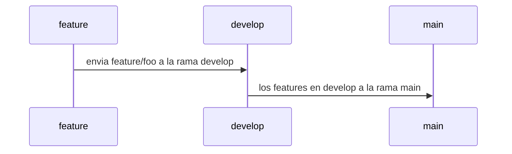

# SOCIAL OPLESK
### 🏴‍☠️ HACK-1:1

<br/>

📚 docs [markdown 1](https://agea.github.io/tutorial.md/) | [markdown 2](https://docs.github.com/es/get-started/writing-on-github/getting-started-with-writing-and-formatting-on-github/basic-writing-and-formatting-syntax) | [archivos de salud](https://docs.github.com/es/communities/setting-up-your-project-for-healthy-contributions/creating-a-default-community-health-file)
---
📚 docs [comandos git](https://gist.github.com/dasdo/9ff71c5c0efa037441b6) | [conventional commit](https://www.conventionalcommits.org/en/v1.0.0/)
---

```diff
-  NOTA: debes crear por cada hack un PULL_REQUEST_TEMPLATE y un flujo de tres ramas (main / develop / tus feature).
```

```diff
* Clonar el repositorio
* Definir un contenido en el README.md con la siguiente estrucutra:
  * (titulo con el número del hack) 
  * (si deseas anexar más info al README.md, tienes la libertad de expresar tus ideas)
* Copie el fragmento del texto que esta contenido en el sector PULL_REQUEST_TEMPLATE en el archivo PULL_REQUEST_TEMPLATE.md
```
<br/>

🎬 Clonar Repo.


<br/>

|Hacks | Details | 
|----------|---------|
| H-1      | Position or Free Mode |
| H-2      | Float |
| H-3      | Flex | 
| H-4      | Free Mode | 
| H-5      | Free Mode | 
| H-6      | Free Mode | 


<br/> 

---

### WORKFLOW



---

PULL_REQUEST_TEMPLATE
# Tecnología
- [ ] HTML
- [ ] CSS3
- [ ] docs

# Seleccione el tipo de actividad
- [ ] Feature
- [ ] Changes
- [ ] Hotfix
- [ ] Refactor
- [ ] Performance
- [ ] Testing

---

<br/> 

#TIPS
```
   1) los hacks son individuales, ten encuenta el apoyo de tú equipo, para resolverlos.
     
   2) Detectar elementos flotantes clear:both | right | left;

   3) Background Image: crear un elemento div | section dentro de un conteneder block y aplicar:
    position (relative al padre, position absolute al elemento hijo), que va a tener  la imagen
    adicional establecer al elemento hijo:

    width: 100%;
    height: 200px;
    background-size:cover;
    background-repeat:no-repeat;
    background-image: url(path);
    background-position: center center;
    z-index: -1;

    Además el background del elemento padre background: none;
```
---

## 🏆 H-1

🎬 Cómo preparar el ambiente del hack.


#### 👽 Frontend (Position or Free mode)
```sh
 1. Crear el hack html mediante el uso de position relative / absolute ó modalidad libre
    - se prohibe el uso de float
    - se prohibe el uso de flex
```     
 
---
## 🏆 H-2
#### 👽 Frontend (Float)

```sh
 2. Crear el hack html mediante el uso de float
    - se prohibe el uso de position
    - se prohibe el uso de flex

```

---
## 🏆 H-3
#### 👽 Frontend (Flex)

```sh
 3. Crear el hack html mediante el uso de flex
    - se prohibe el uso de position
    - se prohibe el uso de float

 
```

---
## 🏆 H-4
#### 👽 (Free Mode)

```sh
 4. Crear el hack con las habilidades vistas en clases:
    - diseñar únicamente mediante position / float / flex.
    - tú decides cuales aplicar para lograr el objetivo.
 
```

---
## 🏆 H-5
#### 👽 (Free Mode)

```sh
 5. Crear el hack con las habilidades vistas en clases:
    - diseñar únicamente mediante position / float / flex.
    - tú decides cuales aplicar para lograr el objetivo.
 
```

---
## 🏆 H-6  
#### 👽 (Free Mode) - 🔔 It is not required, optional 🔔 

```sh
 6. Crear el hack con las habilidades vistas en clases:
    - diseñar únicamente mediante position / float / flex.
    - tú decides cuales aplicar para lograr el objetivo.
 
```
